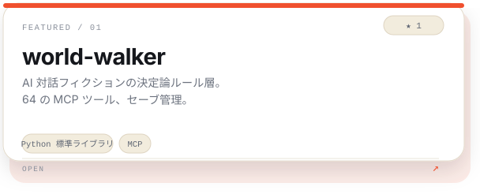
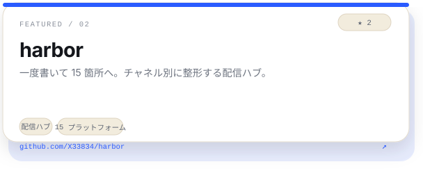
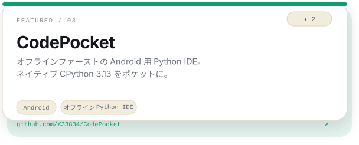

<a href="README.md">English</a> · <a href="README.zh-CN.md">中文</a> · <b>日本語</b>

<picture><source media="(prefers-color-scheme: dark)" srcset="assets/hero-ja-dark.svg" /></picture>

## 01 · いま

- **apache/airflow** はマージ済み。betterleaks と lefthook はレビュー中
- **world-walker**、**harbor** とオフライン mobile ツールを維持
- コードを読むのが仕事であり趣味

## 02 · 代表作

<a href="https://github.com/X33834/world-walker"><picture><source media="(prefers-color-scheme: dark)" srcset="assets/work-1-ja-dark.svg" /></picture></a> <a href="https://github.com/X33834/harbor"><picture><source media="(prefers-color-scheme: dark)" srcset="assets/work-2-ja-dark.svg" /></picture></a>

<a href="https://github.com/X33834/CodePocket"><picture><source media="(prefers-color-scheme: dark)" srcset="assets/work-3-ja-dark.svg" /></picture></a> <a href="https://github.com/X33834/mashang"><picture><source media="(prefers-color-scheme: dark)" srcset="assets/work-4-ja-dark.svg" /></picture></a>

## 03 · 数字

<picture><source media="(prefers-color-scheme: dark)" srcset="assets/numbers-ja-dark.svg" /></picture>

## 04 · 配信ライン

<a href="https://blog.csdn.net/weixin_56622231"><picture><source media="(prefers-color-scheme: dark)" srcset="assets/channel-csdn-ja-dark.svg" /></picture></a> <a href="https://juejin.cn/user/2350111542479753"><picture><source media="(prefers-color-scheme: dark)" srcset="assets/channel-juejin-ja-dark.svg" /></picture></a>

- 2026-11-04 — [把 AI Agent 接进业务系统，我踩了 3 个挺蠢的坑](https://blog.csdn.net/weixin_56622231/article/details/170051167)
- 2026-10-18 — [Gemini 4 Argon 全面开放：谷歌憋了半年的旗舰大招，到底行不行？](https://blog.csdn.net/weixin_56622231/article/details/168251657)

<a href="https://blog.csdn.net/weixin_56622231">CSDN の全記事 →</a>

## 05 · 棚の続き

> [harbor](https://github.com/X33834/harbor) · [CodePocket](https://github.com/X33834/CodePocket) · [moneyhelper](https://github.com/X33834/moneyhelper) · [digilegacy](https://github.com/X33834/digilegacy)

Upstream: [ohmyzsh](https://github.com/ohmyzsh/ohmyzsh) · [icalendar](https://github.com/python-icalendar/icalendar) · [apache/airflow](https://github.com/apache/airflow) · [renovate-operator](https://github.com/mogenius/renovate-operator)

One source, five profiles · numbers from a local snapshot

すべてのリポジトリ: [github.com/X33834](https://github.com/X33834)
