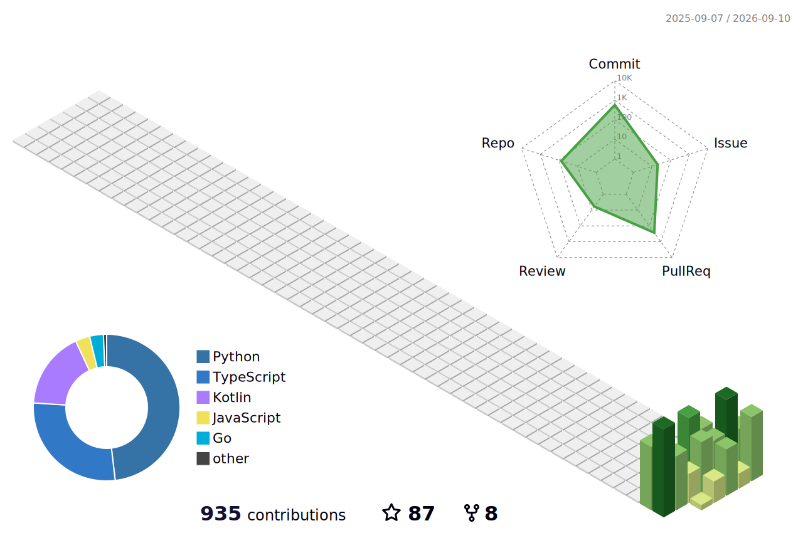
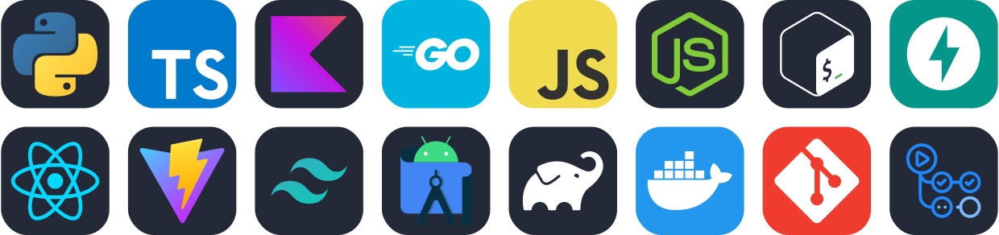

[English](README.md) | [中文](README.zh.md) | [日本語](README.ja.md)

  

  

## 关于

一名把抽象想法落地为可交互界面的开发者。专注全栈与创意工具，偏爱简洁、有质感的设计，反感千篇一律的模板。代码与星空同理，精巧之处藏在细节里。

- **近期在折腾**：交互可视化、自动化工作流、能让人会心一笑的小工具
- **常用语言**：TypeScript / Python / Rust

### 🌐 四平台镜像 &nbsp;`一页 · 四地 · 互为镜像`

> 同一份主页在四个平台互为镜像同步——GitHub 双账号 + GitCode + Gitee，贡献与作品跨平台聚合展示。

| 平台 | 账号 | 定位 |
|------|------|------|
| **GitHub** | [X33834](https://github.com/X33834) | 开源贡献 · 上游 PR ◆ |
| **GitHub** | [Morningstar202604](https://github.com/Morningstar202604) | 作品集 · 奶龙系列 / 工具集 |
| **GitCode** | [badhope](https://gitcode.com/badhope) | 移动端开发 · 离线工具 |
| **Gitee** | [badhope](https://gitee.com/badhope) | 作品镜像 · 小程序 |

## 统计

<!-- STATS:START -->
- ⭐ **12** stars（四平台取最大）&nbsp;·&nbsp; 👥 **13** followers &nbsp;·&nbsp; 📦 **16+ 项目**（以 GitCode 为准）
<!-- STATS:END -->

  

## 连续提交

  

## 贡献热力图

  

  

## 技术栈

  

  
  
  

## 项目

<!-- PROJECTS:START -->
- **[bot4cj](https://gitcode.com/badhope/bot4cj)** · 6★ · 基于仓颉语言的硬件机器人控制框架 · `硬件 · 机器人`
- **[mobilecode](https://gitcode.com/badhope/mobilecode)** · 1★ · Android 端 AI 编程助手（BYOK 离线运行） · `移动端 · Kotlin`
- **[dev-terminal](https://gitcode.com/badhope/dev-terminal)** · 0★ · 完全离线的安卓编程终端 — 手机上的现代 IDE · `移动端 · 离线`
- **[awesome-skillkit](https://gitcode.com/badhope/awesome-skillkit)** · 3★ · Agent Skills 场景包 · 27 packs / 11 分类 · `AI 工具链`
- **[scholarhub](https://gitcode.com/badhope/scholarhub)** · 1★ · 学术期刊与预印本多租户平台 · `SaaS`
- **[FinHub](https://gitcode.com/badhope/FinHub)** · 0★ · AI 投资研究 Agent 平台 · `量化 · 金融`
- **[VerdictAI](https://gitcode.com/badhope/VerdictAI)** · 0★ · 多智能体法庭辩论系统 · `多智能体`
- **[mashang-python](https://gitcode.com/badhope/mashang-python)** · 0★ · 码上 Python · PY//NOW 赛博朋克风学习终端 · `教育`
- **[KeBaiPay](https://gitcode.com/badhope/KeBaiPay)** · 0★ · 科佰支付 · 自托管开源支付中台 · `支付`
<!-- PROJECTS:END -->

## 开源贡献

代码已合入多个高知名度的开源上游项目——**GitHub 两账号合计 16 个 PR 被合并**，其中不乏 **_ohmyzsh（189k★）_、_tldr-pages（64k★）_** 这样的明星项目。

### ⭐ 高含金量 · 已合并

<table align="center">
  <tr><td align="center" width="280"><b><a href="https://github.com/ohmyzsh/ohmyzsh">ohmyzsh/ohmyzsh</a></b> ⭐189k <a href="https://github.com/ohmyzsh/ohmyzsh/pull/14006">#14006</a> · <a href="https://github.com/ohmyzsh/ohmyzsh/pull/14021">#14021</a> · <a href="https://github.com/ohmyzsh/ohmyzsh/pull/14027">#14027</a> fix(git): force C locale · fix(pipenv): keep activation · fix(aws): asr error 命令行狂魔的必修课 · 12 万+ 项目依赖</td><td align="center" width="280"><b><a href="https://github.com/tldr-pages/tldr">tldr-pages/tldr</a></b> ⭐64k <a href="https://github.com/tldr-pages/tldr/pull/23780">#23780</a> doctl CLI 手册页 社区驱动命令手册 · 跨平台 CLI 帮助</td></tr>
  <tr><td align="center" width="280"><b><a href="https://github.com/collective/icalendar">collective/icalendar</a></b> ⭐1.2k <a href="https://github.com/collective/icalendar/pull/1731">#1731</a> · <a href="https://github.com/collective/icalendar/pull/1750">#1750</a> · <a href="https://github.com/collective/icalendar/pull/1751">#1751</a> docs: public exports · deprecate single_string_parameter · TYPE_CHECKING imports Python iCalendar 标准库生态</td><td align="center" width="280"><b><a href="https://github.com/nix-community/NUR">nix-community/NUR</a></b> ⭐2k <a href="https://github.com/nix-community/NUR/pull/1220">#1220</a> treat SSL errors as transient Nix 用户仓库 · 社区分发中枢</td></tr>
</table>

此外还合入 [EnderBridge](https://github.com/Hydrooxzgen/EnderBridge)（110★）、[claude-tool-agent](https://github.com/jaychouchannel/claude-tool-agent)（Agent 编排 ×3）等项目的 PR。

### 🚧 评审中

另有 **pydantic / galaxy / LibreChat / PDFMathTranslate / getmoto / zsh-completions / LibrePhotos / freeCodeCamp / awesome-mcp-servers** 等 20+ 项目在评或已提。

### 📌 四平台贡献一览

- **GitHub · Morningstar202604** — [链接](https://github.com/Morningstar202604) · **12 PRs merged**
- **GitHub · X33834** — [链接](https://github.com/X33834) · **4 PRs merged**（Nailong-Studio/website ×4）+ 评审中：airflow #73099 · MonkeyCode #1298 · simona #1–6
- **GitCode · badhope** — [链接](https://gitcode.com/badhope) · 16 个开源项目镜像（移动端 IDE / AI 助手 / 学习终端）
- **Gitee · badhope** — [链接](https://gitee.com/badhope) · 项目镜像 + 小程序作品集

## 博客

<!-- BLOG:START -->
- [2026年分布式系统设计趋势深度解析：从CAP到BASE，从一致性到可用性的平衡艺术](https://blog.csdn.net/weixin_56622231/article/details/164628304) · `2026-09-08` · CSDN
- [2026年后端架构设计趋势深度解析：从单体到微服务，从分布式到云原生](https://blog.csdn.net/weixin_56622231/article/details/164626416) · `2026-09-08` · CSDN
- [2026年开发工具与效率提升指南：从IDE到命令行，打造你的开发战斗机](https://blog.csdn.net/weixin_56622231/article/details/164625248) · `2026-09-08` · CSDN
- [DevOps 深度指南：从理念到实践](https://blog.csdn.net/weixin_56622231/article/details/164624608) · `2026-09-08` · CSDN
- [2026年数据结构与算法学习指南：从入门到精通，程序员的必修之路](https://blog.csdn.net/weixin_56622231/article/details/164623812) · `2026-09-08` · CSDN
- [2026年代码编辑器发展趋势深度解析：从Vim到VS Code，从本地到云端的演进之路](https://blog.csdn.net/weixin_56622231/article/details/164623121) · `2026-09-08` · CSDN
<!-- BLOG:END -->

## 开源雷达

  值得关注的工具和框架。

  
  
  
  
   
  
  
  
  
   
  
  
  
  

## 在别处

> 同一身份 · 四个平台互为镜像同步

  
  
  
  
 

  

  &copy; Morningstar202604

